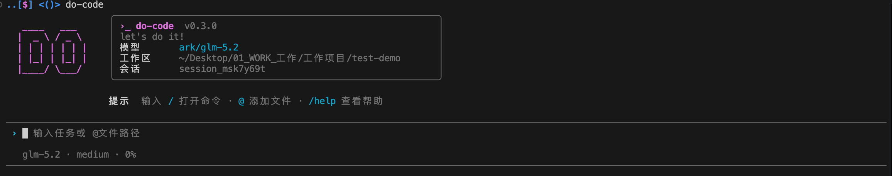

<div align="center">

# do-code

**Agente de programación de código abierto.**

Lee código, edita archivos, ejecuta comandos y verifica resultados en tu terminal y espacio de trabajo.

[](https://github.com/tree201/do-code/actions/workflows/ci.yml)
[](https://nodejs.org/)
[](LICENSE)

[English](README.md) | [中文](README.zh-CN.md) | [日本語](README.ja-JP.md) | [한국어](README.ko-KR.md) | [Español](README.es-ES.md) | [Français](README.fr-FR.md)

[Inicio rápido](#installation) · [Documentación](docs/README.md) · [Contribuir](CONTRIBUTING.md) · [Seguridad](SECURITY.md)

</div>

<p align="center">
  
</p>

---

## Instalación

Se requiere Node.js `20.19+` o `22.12+`.

Ejecutar desde el código fuente:

```bash
git clone https://github.com/tree201/do-code.git
cd do-code
npm install
npm run build:agent
npm link
```

Después, inicia en un proyecto existente:

```bash
cd /path/to/your-project
do-code auth
do-code
```

`do-code auth` te guía durante la configuración del proveedor. Las claves API se guardan solo en la configuración de usuario local; las variables de entorno anulan los valores guardados.

> [!NOTE]
> Instala el paquete npm con `npm install -g @tree201/do-code`. Para el primer uso, inicia dentro de un repositorio Git y utiliza el modo de permisos predeterminado.

## Qué hace

- **Funciona en repositorios reales** — lee y adjunta archivos, edita código, ejecuta comandos de shell, inspecciona diferencias de Git y ejecuta pruebas.
- **Utiliza tu proveedor de modelos** — configuración integrada para Volcengine Ark, Alibaba ModelStudio, DeepSeek, MiniMax, Z.AI y ModelScope; Custom Provider admite las API compatibles con OpenAI, Anthropic y Gemini.
- **Mantiene la ejecución bajo control** — los modos de planificación y permisos son independientes, y las ediciones de archivos y parches integrados reciben puntos de control locales para inspección o recuperación.

Escribe `/` para explorar comandos y `@` para adjuntar archivos del espacio de trabajo:

```text
/plan · /permissions · /model · /resume
/status · /stats · /compact · /diff
/memory · /rewind · /export · /language
@src/app.ts           Añadir un archivo al contexto actual
!npm test             Ejecutar un comando con el modo de permisos actual
```

Usa `/thinking` y `/effort` para ajustar el razonamiento durante una sesión; añade `--persist` para guardar la elección como predeterminada para futuras sesiones. La interfaz admite inglés, chino simplificado, japonés, coreano, español y francés mediante `--language` o `/language`.

## Ejecútalo a tu manera

### Terminal interactiva

```bash
do-code
do-code --continue
do-code resume <session-id>
```

### Sesiones y contexto

Continúa la sesión más reciente del proyecto con `do-code --continue`, o elige una con `resume` y `/resume`:

```bash
do-code sessions list
do-code sessions search "authentication"
do-code sessions rename <session-id> "Auth cleanup"
do-code sessions delete <session-id>
do-code sessions export <session-id> md ./session.md
```

Usa `/stats` para inspeccionar el uso de contexto y `/compact` para compactarlo cuando lo necesites. Cerca del límite de contexto, do-code compacta automáticamente mientras conserva rutas, comandos, decisiones y estado de verificación importantes.

### Instrucciones del proyecto y aislamiento

Las instrucciones en capas de `AGENTS.md` siguen la jerarquía del espacio de trabajo; inspecciónalas o recárgalas con `/memory`. Inicia un Git worktree aislado con `do-code --worktree` o `do-code --worktree=<name>`, e inspecciona los worktrees de do-code con `do-code worktrees`.

### Perfiles y extensiones

Los perfiles de agente pueden seleccionar un modelo, modo de aprobación, instrucciones, límite de pasos y listas de permitidos/denegados de herramientas. Inspecciónalos con `do-code agents` y selecciona uno con `do-code --agent <name>`. Explora comandos y habilidades de Markdown con `/extensions`; usa `do-code extensions` para ver un resumen de comandos, habilidades y servidores MCP configurados.

### Scripts y CI

`run` genera una salida JSON o JSONL estable para automatización. Las tareas pueden provenir de un argumento o de `--task-file`; `--max-steps` y `--timeout` establecen presupuestos de ejecución. `--artifact-dir` guarda la configuración congelada, el flujo de eventos, el resultado y los artefactos de parche.

```bash
do-code run --yes --output-format stream-json \
  --task-file task.txt --artifact-dir ./artifacts \
  --max-steps 40 --timeout 600
```

Usa `do-code acp` para el protocolo estándar de entrada/salida ACP. Consulta el [protocolo sin interfaz / JSONL](docs/headless-protocol.md) para conocer el contrato de automatización compatible.

### Entrada de imágenes

Adjunta hasta cuatro imágenes PNG, JPEG, GIF o WebP con `--image` repetido en modo sin interfaz. El modelo seleccionado debe admitir entrada de imágenes.

```bash
do-code run --image screenshots/bug.png --image screenshots/diagram.webp "Describe these images"
```

En la TUI interactiva, escribe `@path/to/image.png` o usa `/paste-image` para importar una imagen desde el portapapeles del sistema. Usa `/remove-image <index|name>` para eliminar un adjunto pendiente. Cada imagen está limitada a 10 MB y el total del prompt está limitado a 20 MB. Los archivos importados se copian a `~/.local/share/do-code/projects/<project-key>/sessions/<session-id>/attachments/`; los mensajes persistidos solo contienen referencias relativas como `attachments/image_xxx.png`, nunca datos Base64 ni la ruta absoluta original. Establece `DO_CODE_DATA_DIR` para anular la raíz de datos global. Los datos existentes de `.do-code` locales al proyecto se migran al directorio de proyecto administrado por el usuario cuando se accede al proyecto la próxima vez.

### Comandos CLI útiles

```bash
do-code config show          # Inspeccionar la configuración efectiva del modelo
do-code doctor               # Comprobar el modelo, el espacio de trabajo y las herramientas locales
do-code sessions list        # Listar las sesiones del proyecto
do-code extensions           # Inspeccionar comandos, habilidades y configuración MCP
do-code agents               # Listar perfiles de agente
do-code worktrees            # Listar worktrees aislados
do-code errors list          # Listar informes de errores recientes
```

## Seguridad y datos

El modo **Ask** predeterminado solicita confirmación para acciones de alto riesgo. **Auto** gestiona automáticamente los cambios ordinarios del espacio de trabajo. **Full Access** está destinado únicamente a espacios de trabajo de confianza o CI.

La configuración se almacena en `~/.config/do-code/`; las sesiones del proyecto, adjuntos, puntos de control e informes de errores se almacenan en `~/.local/share/do-code/projects/<project-key>/`. `DO_CODE_DATA_DIR` anula la raíz de datos. Las credenciales y los datos del proyecto permanecen en tu máquina de forma predeterminada.

La configuración de sandbox puede usar ejecución local, macOS Seatbelt o un contenedor, según la configuración y la compatibilidad del host. El modo de permisos y la configuración de sandbox son controles independientes.

Para inspeccionar un error:

```bash
do-code errors list
do-code errors show <error-id>
```

## Documentación

- [Índice de documentación](docs/README.md)
- [Comentarios sobre casos problemáticos y diagnósticos](docs/bad-case-feedback.md)
- [Protocolo sin interfaz / JSONL](docs/headless-protocol.md)
- [Arquitectura](docs/architecture.md)
- [Desarrollo local](docs/local-development.md)
- [Proceso de lanzamiento personal](docs/releasing.md)

## Contribuir

Las incidencias y solicitudes de extracción son bienvenidas. Lee la [guía de contribución](CONTRIBUTING.md) y la [política de seguridad](SECURITY.md) antes de enviar un cambio.

```bash
npm run verify:local
npm run build:agent
```

## Licencia

[Apache-2.0](LICENSE)
